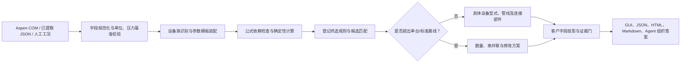

# 设备设计选型系统

这是一个面向化工流程设计的确定性设备计算与选型系统。它接收 Aspen 工艺结果或人工工况，先建立可审计的参数链，再执行设备计算、具体工程型式选择、管线与连接部件初筛、异常工况修改建议和客户报告生成。

系统的目标不是让大模型“猜一个设备”，而是让程序回答并留下证据：

1. 输入数据来自哪里；
2. 哪些参数是 Aspen/用户直接给出的；
3. 哪些参数由内置公式或登记默认值补算；
4. 实际执行了哪些计算；
5. 哪条终选规则产生了设备型式；
6. 为什么需要多台、串联、并联或专项设计；
7. 还缺哪些厂家曲线、专业软件结果或正式设计证据。

## 核心能力

### Aspen 与工况数据

- 支持 `.bkp`、`.apw`、`.inp` 的隔离副本处理；
- 可通过 Aspen COM 遍历模块、流股、单位、运行状态和上下游连接；
- 可在用户允许时重新运行案例并保存历史证据；
- 将压力、温度、流量、密度、黏度、相态、热负荷等转换为统一字段；
- Aspen 不建模的管线由程序根据流量、目标流速、标准 DN/外径目录和校核公式计算；
- 缺失黏度等物性允许使用登记公式估算时，固定标记“内置公式计算”和暂定警告。

### 设备计算与具体型式选择

- 采用“先计算、后选型”，不会仅凭设备存在就宣称完成；
- 每类设备使用登记的参数模板、公式需求和终选规则；
- 17 个设备族均可返回具体工程型式；
- 不使用“非标准型”“其他”“待定型设备”充当推荐名称；
- 条件不足时仍返回登记的通用工程型式，同时把不能证明的内容列入证据缺口；
- 只有同一设备、同一工况的正式证据满足要求时，才允许升级标准型号或厂家型号状态。

### 缺项时的登记保底档案

保底值只用于初步筛选，优先级始终低于 Aspen、用户输入和同工况正式证据。程序会逐字段记录 `source_kind`、档案 ID、采用原因、适用边界和警告；用户在计算流程中覆盖任一保底字段后，可对单台设备重算，也可恢复登记默认值。

- 填料塔水力学缺少内件数据时，采用 `250Y金属孔板波纹规整填料（程序保底）`：S30408、比表面积 250 m²/m³、空隙率 0.97、波纹倾角 45°、设计液泛率 0.70、初筛 HETP 0.50 m、填料层压降 0.40 kPa/m、单段最大床层高度 6.0 m。程序据此估算床层高度、分段数、液体再分布器数量和总压降，并生成具体塔器工程标识；正式液泛、持液量、传质效率、分布器和厂家内件设计仍保持开放证据门。
- 管壳式换热器缺少结构参数时，采用固定管板、1 壳程 2 管程、正三角形管束等登记初筛路线，并按介质、氯离子、温度和卫生条件选择具体壳体/管束材料路线。
- 明确为可拆式板式换热器且缺少结构参数时，采用 `gasketed_chevron_plate_s31603_epdm_preliminary`：S31603 传热板、EPDM 垫片、Q345R 环氧涂层框架、H 型人字波纹、板厚 0.6 mm、板间隙 3.0 mm、单板参考面积 0.50 m²、1×1 流程。板片数按所需面积重算并形成如 `PHE-GASKETED-CHEVRON-A19.6-N42-S31603-EPDM` 的程序工程标识。
- 管壳式与板式字段互斥：板式结果不会混入换热管外径、折流板和管束排列；管壳式结果不会混入板片间隙、垫片和板片数量。

上述结果固定为 `J / provisional / TYPE_SCREENING`，不是厂家最终型号，也不能代替机械强度、材料相容性、压力—温度额定、热工水力专业软件或厂家性能数据。

### 管线与连接部件

管线结果可包含：

- 具体管道型式；
- 公称直径 DN；
- 外径；
- 计算内径；
- 壁厚或壁厚系列；
- 材料；
- 设计压力及压力基准；
- 设计温度；
- 实际流速；
- 计算、目录匹配和证据状态。

法兰、垫片和管件由登记的连接部件选择器处理。材料、密封面、压力等级或连接型式不明确时，程序只能采用登记路线或明确保留缺口，Agent 不得自由创造零部件型号。

### 超界及非标准工况的系统修改方案

当单台设备落在标准路线之外时，系统不只返回“无匹配”，而是生成结构化修改方案：

- 大换热器：估算并联台数、单台面积、单台热负荷和负荷分配；
- 奇异泵工况：估算并联列数、每列串联台数、运行台数、备用台数和单机 Q/H；
- 泵材料与密封：按介质、腐蚀性、危险性、含固量、黏度和温度的登记分支，具体选出泵壳、叶轮、轴、轴套、机械密封、辅助密封和垫片；
- 泵承压：按程序选定的串联级数逐级计算关死工况最大出口压力，选择最低满足值的 PN 系列，并校核末级泵是否仍处于 GB/T 5662 的 16 bar 路线范围；
- 轴流泵、多级泵等终选路线不会误套 GB/T 5662 轴向吸入泵参考点；
- 大塔：估算并列塔数量和单列负荷，正式塔径、塔高和塔内件水力学保持开放；
- 无法安全自动拆分时，给出专项评审路线，而不是虚构一个“非标准型号”。

每个方案均包含：

- `program_generated: true`；
- 触发条件代码；
- 数量和串并联配置；
- 单机目标工况；
- 具体系统候选标记；
- 固定算法警告；
- 厂家曲线、NPSH、EDR、塔内件、机械、材料、控制和管道复核动作；
- 方案 SHA-256。

上述方案固定属于 `J / provisional / TYPE_SCREENING`，不能直接作为采购型号或正式设计。

## 工作机理



### 算法代码从哪里开始看

单台设备的运行时算法总入口是
[`scripts/equipment_design_match.py::match_one`](scripts/equipment_design_match.py#L7713)，
公式调度中心是
[`run_calculations`](scripts/equipment_design_match.py#L3605)。
人工输入从 `app/app_core.py::manual_match` 进入；Aspen 输入从
`scripts/aspen_equipment_derivation.py::derive_bundle` 进入；管线由
`derive_piping` 独立计算。

`scripts/equipment_calc.py` 文件前部提供管径、壁厚、泵功率、压比、塔底持液高度、膜面积、传热和 Ergun 压降等基础公式；同一文件后部还包含离线计算台账与教材公式审计，因此它不是 GUI 运行时的单一总入口。

每个文件、关键函数、调用顺序和泵/管线示例见
[算法源码导航](docs/ALGORITHM_GUIDE.md)。

### 1. 输入规范化

系统先把 Aspen、人工输入和已有计算结果转换为统一字段。压力必须声明绝压或表压；需要换算时必须提供当地大气压。单位、空值、相态和枚举值会被校验，错误值不会静默进入公式。

输入来源同时被记录：

- Aspen/用户直接值；
- 同工况已有结果；
- 内置公式输出；
- 登记的预设计建议；
- 尚未提供的正式证据。

### 2. 参数包与计算前置检查

每个设备族有独立参数模板。模板区分：

- 主计算必需输入；
- 候选闭合输入；
- 可选偏好；
- 已有结果；
- 高级设计条件；
- 正式定型证据。

缺少某个参数时，只暂停依赖它的计算，不会丢弃其他已经闭合的链条。程序保留“已执行、等待输入、不适用、已有同工况结果满足”等不同状态，避免把“有字段”误报成“公式已执行”。

### 3. 确定性公式计算

计算器按照已登记依赖关系执行，例如：

- 泵压差压头、水力功率、轴功率和 NPSH 裕量；
- 换热面积及换热管数量初筛；
- 塔截面积、有效区、孔区、表观速度、塔内高度和持液高度；
- 容器几何容积、所需容积、设计压力和基础厚度；
- 管线所需内径、标准 DN、实际流速和设计压力；
- 压缩机压力比；
- 膜面积；
- 阀门液体等效 Cv 和压降初筛。

每一条计算保存：

- 计算 ID；
- 输入字段；
- 公式；
- 代入链；
- 数值和单位；
- 适用边界；
- 结果状态；
- 来源等级；
- 计算链 SHA-256。

### 4. 终端型式选择

计算完成后，程序生成特征向量并执行登记规则：

1. 用户明确指定且允许时，使用已登记型式；
2. 条件命中终选规则时，使用条件选定型式；
3. 条件不足时，使用该设备族的登记通用型式；
4. 标准目录能够闭合时，返回标准标记候选；
5. 正式证据不足时，保持工程候选或型式初筛，不能升级厂家最终型号。

Agent 可以帮助判断文字条件，但只能返回已有规则 ID、条件 ID 和上下文哈希。程序重新验证后才应用，模型自由编写的设备名称不会进入确定性结果。

### 5. 超界判断与调整

程序在型号匹配后检查单台面积、泵终端路线、塔筛选尺寸、NPSH/压力等边界。命中触发条件后，调整器先读取计算链，再按固定策略估算设备数量和负荷分配。

修改方案与原计算、终选结果及证据边界分别保存，避免后处理文字覆盖原始计算。用户能够看到方案为什么触发、程序用了什么阈值，以及哪些内容仍需专业复核。

### 6. 连接部件闭合

设备型式完成后，连接选择器根据登记的介质、压力、温度、材料、DN、连接方式和密封条件处理管件、法兰及垫片。连接结果、使用的终端规则和包版本会重新写入 Agent 控制记录并计算哈希。

### 7. 客户交付与报告

结果不会直接把内部 JSON 原样展示给用户。客户交付层会验证上游计划和控制记录的 SHA-256，并按固定顺序投影：

1. **基本信息**：设备位号、设备族、程序实际选定的具体工程型式、型号/规格、数量和串并联方式；
2. **分支选择（自然文字）**：说明程序为什么识别为该设备族、命中了哪条终选规则、候选如何排序、是否进入多台或非标准工况路线；
3. **小部件选择分支**：按每个进出口分别给出法兰、密封面、垫片、紧固件等实际选择、条件、规则、缺口和警告；
4. **大模型调控结果**：显示本次是否调用 LLM、模型判断、建议、程序复核结果，以及哪些建议真正进入了确定性重算；
5. **详细计算链条**：逐条给出公式、代入值、单位、来源、适用边界、执行状态和追溯哈希；
6. **候选与系统修改方案、强制警告、待补证据和下一步动作**。

其中 `selected_output`、`branch_selection`、`component_selections`、
`llm_control_result` 和 `detailed_calculation_chain` 是不同对象：前四项先回答
“程序选了什么、走了哪条路、大模型做了什么”，最后一项才展开数值推导。
LLM 没有运行、调用失败后回退、只完成审核、或建议已经通过程序复核并触发重算，
都会以不同状态如实显示，不会用一段笼统的“AI 建议”代替真实执行记录。

报告支持 HTML、Markdown 和完整 JSON，并生成 `.manifest.json`，绑定源结果、展示对象、组织答案和报告文件哈希。

## 可视化推导工作台

GUI 提供六个可点击节点：

1. 数据来源与工况；
2. 设备族与计算模板；
3. 公式计算与交叉核对；
4. 型式、材料与部件选择；
5. 候选与系统修改方案；
6. 客户交付与证据门。

点击节点可以查看程序默认值、当前场景值、模板、公式和证据边界。允许修改的项目使用中文下拉框或输入框；内部仍保存稳定代码，保证接口和重算一致。

用户可以：

- 修改当前设备的允许字段；
- 只重算当前设备；
- 恢复单项默认；
- 恢复当前设备的全部程序默认；
- 对比基线结果和人工场景；
- 查看覆盖记录和重算 SHA-256。

人工修改不会覆盖 Aspen 源文件，也不能绕过正式证据门。

## Agent 与大模型边界

确定性计算、选型、报告和警告不依赖 LLM。接入 LLM 后，Agent 只允许完成以下工作：

- 整理用户文字条件；
- 在登记规则范围内判断模糊选项；
- 规划知识检索；
- 审核确定性结果；
- 按固定结构组织答案。

图形界面同时支持 `chat_completions` 和 `responses` 两种协议。`responses` 路线可显式选择
`minimal / low / medium / high / xhigh` 推理强度，并默认发送 `store=false`；协议、推理强度和
存储开关都进入连接测试指纹，设置改变后必须重新测试并应用。API Key 只在当前进程内存中使用，
不会写入项目、报告或运行清单。

组织答案固定为：

1. 基本信息；
2. 分支选择与大模型调控；
3. 详细计算链条；
4. 候选与系统修改方案；
5. 强制警告；
6. 待补证据；
7. 下一步。

LLM 可以在登记边界内提出条件判断、计算输入建议、终选规则建议和答案组织方案；
每项建议必须经过程序的结构、范围、规则 ID、上下文哈希和证据门复核后才能进入重算。
最终输出同时保留 LLM 原始结构化结果、程序验证记录和实际应用值。LLM 不得绕过复核，
也不得自行修改程序给出的数值、台数、串并联方式、型号/系统标记、警告、证据等级或 `OPEN` 门。

### 触发式 AI 设备型式、材料与零部件选择

当前已为 17 个设备族登记 34 个具体终端型式选项和 36 个材料/零部件组合。GUI 的默认注入点是
“设备型式、材料与零部件受控选择”。触发后，程序只向 LLM 提供当前设备族对应的：

- 工艺与设备背景；
- 可返回的精确 `rule_id / condition_id / axis_id / choice_id`；
- 每个选项的触发条件、选择依据、来源引用、适用警告；
- 当前已知字段、缺失字段、与已有值的冲突以及冻结的选择上下文哈希。

LLM 不能返回自由文字型号或临时发明材料，只能从这些选项中选择 ID 并说明理由。程序随后再次核对
ID、字段和值是否与冻结登记表完全一致，拒绝冲突项，仅补充空缺字段，再调用确定性匹配器重算。
用户输入和 Aspen 同工况值优先，任何 AI 选择都不能覆盖它们。实际进入重算的选择固定记录为
`source_kind=ai_registered_engineering_choice`、`evidence_class=J`、
`promotion_cap=TYPE_SCREENING`，并同时输出登记表哈希、上下文哈希、选择依据、来源和警告。

这两项能力已经进入程序链，但仍属于预设计筛选：AI 的选择不能替代腐蚀相容性审查、材料压力—温度额定、
厂家数据表或正式机械设计。本轮没有把非标设备修改方案等后续 Agent 功能并入这条选择链。

## 设备族覆盖

| 设备族 | 典型输出 |
|---|---|
| 固定管板式换热器 | 面积、管数、设计压力、具体管壳式型式 |
| 其他换热器 | 面积及具体流程换热器型式 |
| 塔器 | 具体板式/填料路线、塔截面与高度链 |
| 反应器/工艺容器/分离器 | 具体立式或卧式工艺容器型式 |
| 储罐 | 具体圆筒储罐型式及容积链 |
| 泵 | 具体泵型、参考标准候选或串并联系统方案 |
| 压缩机/鼓风机/真空设备 | 具体压缩机械型式和压力比 |
| 混合设备 | 具体搅拌/混合设备型式 |
| 干燥/过滤/填料设备 | 对应具体单元设备型式 |
| 膜设备 | 具体膜组件几何路线和膜面积 |
| 机械分离设备 | 具体机械分离型式 |
| 液体动力回收透平 | 液力透平型式及压差功率初筛 |
| 气体膨胀透平 | 径向膨胀透平等具体型式 |
| 工艺管线 | 管道型式、DN、外径、壁厚、材料和流速 |
| 管件 | 对焊管件等具体部件标记 |
| 法兰与垫片 | 法兰、密封面和垫片组合标记 |
| 阀门 | 具体阀门型式、Cv 和压降初筛 |

## 证据与可靠性设计

系统通过以下方式证明结果来自程序而非人工补写：

- 参数来源逐字段记录；
- 公式链逐条保存；
- 终选规则 ID 和条件 ID 固定；
- 参数包、特征向量、计算链、型号候选、调整方案和 Agent 控制记录分别计算 SHA-256；
- 客户交付前重新验证关键哈希；
- 用户覆盖保留程序默认值、人工值、基线哈希和重算哈希；
- 算法建议统一带来源等级、暂定状态和用途上限；
- 正式型号升级必须满足同一设备、同一工况证据门。

因此，“程序给出具体结果”和“该结果已经具备采购/正式设计资格”是两个独立状态，不会混为一谈。

## 内置公式可追溯性

每一条实际执行的内置公式现在都生成 `equipment-formula-trace-v1` 机器记录，不再只显示一个计算结果。记录至少包含：

- 稳定的计算 ID 和公式 ID；
- 公式表达式、目标字段、输出单位和适用条件；
- 每个输入字段的实际值、单位、来源类型、绑定状态和字段值 SHA-256；
- 代入式、输出值和上游公式追溯哈希；
- 知识来源路径、锚点/行号、源文件 SHA-256 和来源绑定状态；
- 执行该公式的代码路径、引擎版本、源码文件 SHA-256、源码集合 SHA-256；
- 公式定义 SHA-256 和本次计算追溯 SHA-256；
- 未闭合的输入来源、外部标准或代码清单缺口。

这意味着用户可以复算数值，并能判断“公式来源已绑定”与“只是程序里写了一条式子”的区别。需要特别说明：**可复算不等于来源全部闭合**。如果匹配器只收到一个规范化数值、但没有 Aspen 节点或用户签名输入的来源绑定，结果会明确标记
`REPRODUCIBLE_TRACE_WITH_OPEN_PROVENANCE`，不会伪装为完全追溯。

GUI“公式链”页直接显示输入、来源、代码与双哈希；HTML/Markdown 报告和 Agent 组织答案也保留完整 `formula_trace`。40 条已登记计算规则均要求有公式 ID、适用范围、不能证明的结论和至少一个来源路由。

追溯字段解释、哈希复核方法、40 条公式覆盖表和仍存在的边界见
[内置公式可追溯性](docs/FORMULA_TRACEABILITY.md)。

## 检索机理

系统存在两条不同的检索链，不能混为“让大模型在资料里找一个答案”：

1. **知识检索**：在允许的本地知识包、标准 SQLite 和源码工作区索引中查找方法、标准切片、表格、公式及证据边界；
2. **设备检索/选型**：把已完成计算的设备特征与登记的型式规则、目录点、硬约束和证据门逐项比较，生成具体工程型式及候选。

知识检索默认选择“设备设计核心图谱”和“设备型号权威图谱”，“设计标准原文证据子图谱”需要显式选择。查询最多 500 字，返回 1～20 项。源码工作区存在向量查询脚本时先使用工作区索引；打包程序或索引无结果时，继续对标准 SQLite 的文本切片、表格、图题和公式题录进行只读检索，再扫描允许的 Markdown、JSON、CSV。排序只决定相关性，不改变证据等级。

标准检索库和结构化执行库是两套不同权威：前者只负责定位证据，后者只允许读取已晋升数据集。程序通过公开注册表绑定当前活动库，并核对状态、大小、SHA-256、表结构、记录数、构建清单和数据集级复用门；隔离库和候选库不能进入运行链。数据库文件、表、调用方和禁用原因见[数据库公开结构与权威合同](docs/DATABASE_STRUCTURE.md)。

设备选型检索不消费 LLM 自由文本型号。程序先规范化单位和相态，完成公式计算，建立选择特征向量，再按设备族、适用工况、硬约束、规则 ID 和目录记录过滤。只有唯一登记的终端型式可以进入推荐；厂家最终型号仍必须经过同设备厂家曲线、性能图或正式设计文件的证据门。

泵标准点与厂家曲线必须分开：GB/T 5662 路线只用于轴向吸入离心泵的标记、额定参考点、尺寸和 16 bar 适用范围筛选，不能冒充某一厂家、某一叶轮直径和转速下的连续性能曲线。设备一览表会单独列出“厂家完整 Q-H、效率、功率和 NPSHr 曲线证据包”；未提供时保持 `OPEN_FORMAL_EVIDENCE_GATE`，但材料/密封、串联逐级承压、末级最大出口压力和法兰 PN 仍由程序完成预选并输出。

检索命中会返回知识包、来源、页码/行号、记录 ID、相关性分数、摘要、原文件 SHA-256、可复用边界和限制。检索结果只能作为计算方法、路由和复核上下文，不能覆盖程序数值、直接升级型号或把旧项目参数迁移到当前设备。

完整的检索路由、排序规则、结果字段和边界见
[检索机理与未实现功能](docs/RETRIEVAL_AND_GAPS.md)。

## 未实现、部分实现和待生产验证

当前版本不是完整的 EPC 详细设计或厂家选型平台。以下状态必须明确：

- **已实现但未完成生产闭环验证**：真实 Aspen COM 添加输运物性、重新运行真实 BKP；远程 LLM 的 `responses` 请求、返回文本解析和 GUI 参数链已实现并通过自动测试，指定端点曾完成精确模型连通，但后续 Agent 审核实测由该服务上游返回 HTTP 502，尚不能标记为生产闭环通过；
- **仅预设计/算法初筛**：泵的具体材料/密封组合与 PN 已能程序预选，但正式腐蚀相容性和压力-温度额定仍待验证；厂家泵型号与完整 Q-H/效率/功率/NPSHr 曲线、压缩机性能图、换热器 EDR、塔内件水力学、完整管网压降、管道应力、设备机械详细设计和材料腐蚀寿命仍未闭合；
- **尚未实现**：DOCX/PDF 正式报告、CAD/P&ID 自动出图、多人项目数据库、采购询价/厂家曲线自动回填和无需人工批准的闭环 Agent；
- **检索限制**：冻结程序的保底检索仍以确定性关键词和 SQLite `LIKE` 为主，不是完整的 BM25/语义混合检索；图片和公式裁图在紧凑运行包中只保留路由元数据；检索命中不证明条款适用。

程序会把这些边界显示为 `provisional`、`TYPE_SCREENING`、开放缺口或固定警告，而不是静默宣称已经完成正式设计。逐项状态、现有能力和补齐条件见
[检索机理与未实现功能](docs/RETRIEVAL_AND_GAPS.md)。

## 使用方式

普通用户请从 GitHub Releases 下载：

- `EquipmentDesignGraphApp.exe`：Windows 图形程序；
- `EquipmentDesignAgentCLI.exe`：无界面 Agent 与自动化接口。

详细操作见 [使用说明.md](使用说明.md)，本次交付核验见 [2.4.0 交付核验](docs/STAGE1_2_4_0_RELEASE_VERIFICATION_20260724.md)。

### 源码运行

依赖见 `requirements-app.txt`。完整冻结知识资产没有进入普通 Git 历史，而是随正式独立程序打包，并在启动时用运行时清单校验。

主要目录与执行关系：

```text
设备设计选型工作包/
├─ app/                 应用入口、GUI、Agent、报告投影、JSON 模式和自动化测试
│  ├─ assets/           程序图标及图标来源清单
│  ├─ fixtures/         可重复执行的请求、Aspen 模拟输入和协议样例
│  ├─ schemas/          模块之间交换对象的 JSON Schema 合同
│  ├─ static/           轻量浏览器界面资源
│  └─ tests/            计算、选型、证据门、GUI 和打包回归测试
├─ scripts/             Aspen 推导、设备计算、具体型式匹配、连接部件选择和审计
├─ data/                小型目录、数据库权威注册表及公开 SQL 结构
├─ knowledge_graph/     公开的确定性匹配规则、参数模板和接口合同
├─ equipment_selection_graph/
│                       公开的设备族、具体型式来源、证据门和标准/厂家路线
├─ docs/                算法导航、项目结构、数据库拆解、检索边界和交付核验
├─ build_equipment_design_app.ps1
│                       Windows 独立程序构建与打包入口
└─ 使用说明.md          面向最终用户的操作说明
```

应用层不会直接凭文字生成型号。一般执行链是
`Aspen/人工输入 → app_core → aspen_equipment_derivation → equipment_calc → equipment_design_match → customer_delivery/result_presentation → GUI、CLI 或报告`。

完整的目录边界、推荐阅读顺序以及仓库内每个文件的具体作用见
[项目目录与逐文件说明](docs/PROJECT_STRUCTURE.md)；数据库版本、表结构、调用链和晋升/隔离规则见
[数据库公开结构与权威合同](docs/DATABASE_STRUCTURE.md)。

### Agent/CLI

CLI 接收 `equipment-design-agent-request-v1` JSON，可执行：

- `manual_match` / `manual_batch`；
- `auto_match`；
- `aspen_import` / `aspen_derive`；
- `pfd_build` / `pfd_override` / `pfd_recalculate`；
- `render_report`；
- `organize_answer`；
- `knowledge_search`；
- `hybrid_prepare` / `hybrid_continue` / `hybrid_run`；
- `selftest`。

连续任务可使用 `--session-jsonl`，让一个常驻进程逐行读取请求并返回响应。

## 验证状态

- 本次非 GUI 全量回归：405 项执行成功，其中 403 项通过、2 项按环境条件跳过；
- 新增受控 AI 选择链专项回归：40 项全部通过，覆盖 17/17 设备族、登记项应用、冲突/虚构项拒绝和确定性重算；
- 图形界面真实窗口测试：发布记录为 30 项通过；本次 Codex Python 运行时缺少 `init.tcl`，27 项需创建窗口的用例未进入业务断言，需在带完整 Tcl/Tk 的构建环境复跑；
- 打包后 Agent/CLI 自检：17 项全部通过；
- 17/17 个设备族具体型式覆盖通过；
- 数据库权威审计：2/2 个活动消费者通过；RAG 库和当前结构化库的大小、SHA-256、`quick_check`、表计数、构建清单及必需数据集均匹配；
- 运行时知识资产：6755 个文件，SQLite `quick_check=ok`；
- 核心源码、知识包与独立程序 SHA-256 见交付核验文档。

## 当前待生产环境验证

- 真实 Aspen 生产机上的 COM 补物性与案例重新运行；
- 远程 LLM 服务上游恢复后，使用 `responses + xhigh + store=false` 完成一次完整 Agent 组织答案验收；
- 厂家曲线、EDR、塔内件水力学和正式机械设计的项目级闭合。
